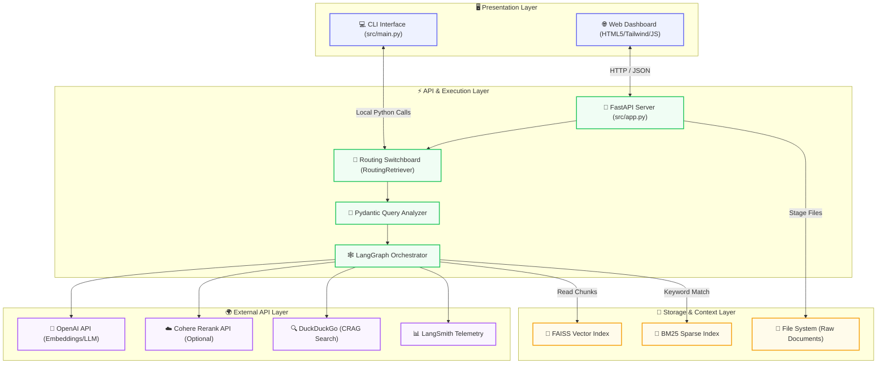
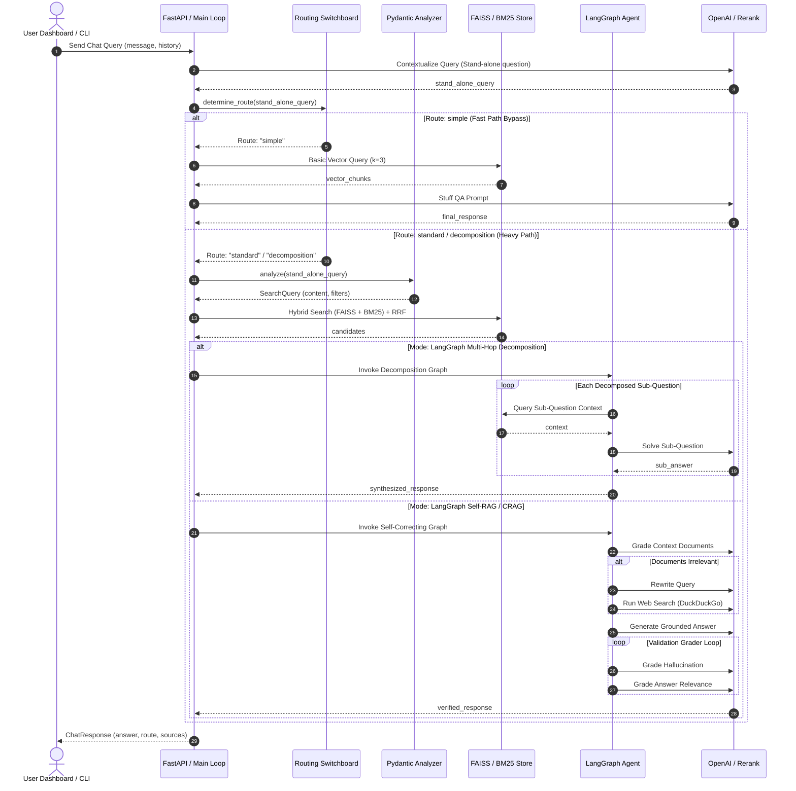
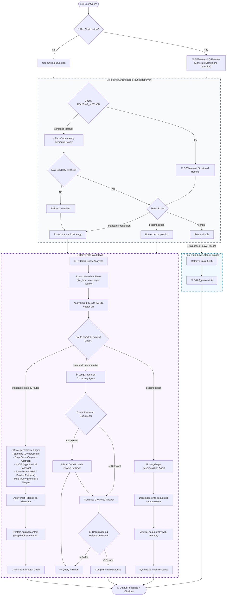

# 🌌 Aether AI: Enterprise Corrective & Self-Reflective RAG Engine

<div align="center">

*A production-grade, locally-persisted Corrective & Self-Reflective Conversational RAG pipeline built on high-fidelity query optimizations, dynamic routing, and multi-agent LangGraph workflows.*

&nbsp;

[](https://www.python.org/)
[](https://github.com/astral-sh/uv)
[](https://github.com/langchain-ai/langgraph)
[](https://github.com/facebookresearch/faiss)
[](LICENSE)

</div>

---

## 🗺️ Table of Contents
* [🪐 Project Overview](#-project-overview)
* [⚡ Key Features](#-key-features)
* [🏗️ System Architecture](#-system-architecture)
* [🔄 Application Request Lifecycle Flow](#-application-request-lifecycle-flow)
* [🔀 Query Routing Decision Flow](#-query-routing-decision-flow)
* [🛠️ Technology Stack](#-technology-stack)
* [🔧 Design Decisions](#-design-decisions)
* [🔌 API Reference Specs](#-api-reference-specs)
* [📁 Folder Structure](#-folder-structure)
* [🚀 Developer Experience & Setup](#-developer-experience--setup)
  * [Environment Configuration](#environment-configuration)
  * [Installation Steps](#installation-steps)
  * [CLI Execution](#cli-execution)
  * [FastAPI Server Execution](#fastapi-server-execution)
* [🐳 Production Deployment (Docker)](#-production-deployment-docker)
* [🔒 Security & Hardening Policy](#-security--hardening-policy)
* [📈 Performance, Scalability & Observability](#-performance-scalability--observability)
* [🛠️ Troubleshooting & FAQs](#-troubleshooting--faqs)
* [🤝 Contributing Guidelines](#-contributing-guidelines)
* [📄 License](#-license)

---

## 🪐 Project Overview

Standard Retrieval-Augmented Generation (RAG) systems frequently struggle in production due to three core challenges: **retrieval noise** (injecting irrelevant text), **hallucinations** (unsupported model outputs), and **high latency** (processing simple tasks through heavy pipelines).

**Aether AI** resolves these issues by organizing RAG execution into a **Dual-Path processing topology**:
1. **The Fast Path (Low-Latency Bypass)**: Simple inputs, greetings, or direct conversation bypass heavy vector stores entirely using an in-memory embedding-based **Semantic Router**, routing queries to a lightweight conversational agent in milliseconds.
2. **The Heavy Path (Self-Reflective Agents)**: Complex queries are routed to specialized pipelines where Pydantic Query Analyzers parse constraints (years, pages, types). Retrieval combines dense (FAISS) and sparse (BM25) search indices via Reciprocal Rank Fusion (RRF), followed by a multi-agent **LangGraph** self-correcting loop. If retrieved documents are irrelevant, the system triggers **Corrective RAG (CRAG)** via DuckDuckGo Web Search. Final answers are validated against hallucinations before reaching the user.

---

## ⚡ Key Features

* 🔮 **Dual-Routing Switchboard**: Supports embedding-based local **Semantic Routing** (zero-token latency, in-memory) and **LLM Routing** (gpt-4o-mini structured schema) to classify query intent.
* 🔬 **Pydantic Query Analyzer**: Automatically extracts database metadata filters (e.g., `publish_year`, `file_type`, `page_number`) and resolves relative dates (e.g., "last year") to build strict database queries.
* 🔀 **Hybrid Retrieval (RRF)**: Combines dense vector retrieval (FAISS) and sparse keyword retrieval (BM25) using Reciprocal Rank Fusion to ensure both semantic capture and exact keyword matches.
* 🕸️ **LangGraph Multi-Hop Decomposition**: Breaks complex, multi-faceted questions into sequential sub-questions, answering them one-by-one using intermediate context memory.
* 🌐 **Corrective RAG (CRAG)**: Grades retrieved documents and dynamically triggers DuckDuckGo web search to gather missing facts when local context is insufficient.
* 🪞 **Double-Guardrail Self-RAG Evaluator**: Uses a two-step validation chain (Hallucination Grader + Answer Relevance Grader) to run verification loops and query rewrites until the output is fully grounded.
* 🌲 **Hierarchical RAPTOR Indexing**: Builds a multi-level tree of document chunks and cluster summaries using Gaussian Mixture Models (GMM) to support high-fidelity global summarization.
* ✂️ **Semantic Chunking**: Identifies meaning-based boundaries by tracking semantic drift across adjacent sentences, preventing paragraph truncation.
* 🎯 **Flashrank CPU Reranking**: Re-ranks candidates locally on CPU using optimized quantized cross-encoder models.

---

## 🏗️ System Architecture

Aether AI utilizes a decoupled multi-layer structure, segregating user interfaces, backend APIs, data pipelines, local databases, and external LLM services.



---

## 🔄 Application Request Lifecycle Flow

This sequence flowchart shows how user requests are parsed, routed, retrieved, graded, and validated:



---

## 🔀 Query Routing Decision Flow

The diagram below details the step-by-step decision routing logic executed within the `RoutingRetriever` (both Semantic and LLM-based) and the main runtime orchestrator:



---

## 🛠️ Technology Stack

* **Core Language & Tooling**: Python 3.12+ managed by [uv](https://github.com/astral-sh/uv) (Rust-powered virtual environment manager).
* **Agentic Framework**: [LangGraph v0.2](https://github.com/langchain-ai/langgraph) & [LangChain v1.0 / langchain-core](https://github.com/langchain-ai/langchain).
* **Vector Store**: [FAISS (Facebook AI Similarity Search)](https://github.com/facebookresearch/faiss) CPU-optimized local database.
* **Sparse Search Engine**: [Rank-BM25](https://github.com/dorianbrown/rank_bm25).
* **Reranker Model**: [Flashrank](https://github.com/prithivida/flashrank) running local quantized cross-encoders via ONNX Runtime.
* **API Framework**: [FastAPI](https://fastapi.tiangolo.com/) + [Uvicorn](https://www.uvicorn.org/) ASGI server.
* **Frontend**: Vanilla HTML5/JS single-page dashboard styled with Tailwind CSS (Premium Glassmorphic Light/Dark mode).
* **Document Parsing**: `pypdf`, `docx2txt`, `beautifulsoup4`, `csv`.

---

## 🔧 Design Decisions

1. **Local Vector Storage (FAISS)**: Using local FAISS database directory indexes keeps operational costs low, eliminates cloud dependencies, and ensures data remains stored locally.
2. **Dense-Sparse Hybrid Retrieval**: Dense embeddings model high-level concepts but fail on precise identifiers like codes, years, or numbers. Combining FAISS with BM25 via Reciprocal Rank Fusion (RRF) preserves both search qualities.
3. **Decoupled Evaluators**: Evaluation agents in LangGraph are configured as isolated nodes with temperature=0 to prevent stochastic variance during verification.
4. **Asynchronous Execution**: Ingestion operations run in separate system-level processes using `asyncio` to prevent blocking the main server thread.

---

## 🔌 API Reference Specs

### Endpoints Overview

| Method | Endpoint | Description | Request Payload | Response Schema |
| :--- | :--- | :--- | :--- | :--- |
| **GET** | `/` | Serves the main UI Dashboard page | None | `text/html` |
| **GET** | `/api/status` | Returns DB metrics, config, and staged files | None | JSON status object |
| **POST** | `/api/config` | Updates routing and reranker configurations | `ConfigUpdateRequest` | Success message |
| **POST** | `/api/chat` | Evaluates query and executes RAG pipeline | `ChatRequest` | `ChatResponse` |
| **POST** | `/api/upload` | Uploads raw documents safely to `./documents/` | Multipart Files | List of saved filenames |
| **POST** | `/api/ingest` | Parses staged files and builds vector DB | Query: `raptor` (bool) | Ingestion log snippet |

---

### Endpoint Payloads & Examples

#### 1. `GET /api/status`
Returns metadata regarding the database status, environment state, active configurations, and list of staged files ready for ingestion.

* **Response Example (`200 OK`)**:
```json
{
  "status": "ready",
  "database_loaded": true,
  "document_chunks": 348,
  "routing_method": "semantic",
  "reranker_provider": "flashrank",
  "openai_api_key_configured": true,
  "langsmith_tracing": false,
  "staged_files": [
    {
      "name": "company_handbook.pdf",
      "size": "1.24 MB",
      "status": "ready"
    }
  ]
}
```

#### 2. `POST /api/config`
Updates configurations dynamically in memory and updates process environment variables, then triggers a clean reload of the active pipeline.

* **Request Schema (`ConfigUpdateRequest`)**:
```json
{
  "routing_method": "llm",
  "reranker_provider": "cohere",
  "openai_key": "sk-proj-OptionalKeyHere",
  "cohere_key": "co-OptionalCohereKeyHere"
}
```
* **Response Example (`200 OK`)**:
```json
{
  "status": "success",
  "message": "Configuration updated and pipeline re-initialized."
}
```

#### 3. `POST /api/chat`
Submits a user query along with session history to be analyzed, routed, searched, reranked, and validated through LangGraph agents.

* **Request Schema (`ChatRequest`)**:
```json
{
  "message": "What were the financial results for the 2025 fiscal year?",
  "history": [
    {
      "role": "user",
      "content": "Hello Aether AI"
    },
    {
      "role": "assistant",
      "content": "Hello! How can I help you index or search your data today?"
    }
  ]
}
```
* **Response Example (`200 OK`)**:
```json
{
  "answer": "According to the financial reports, the 2025 fiscal year yielded $12.4M in revenue...",
  "route": "standard",
  "sources": [
    {
      "title": "financial_report_2025.pdf",
      "source": "./documents/financial_report_2025.pdf",
      "page": 4,
      "snippet": "Net revenue for the fiscal year 2025 reached $12.4M, surpassing projections."
    }
  ]
}
```

#### 4. `POST /api/upload`
Uploads raw PDF, DOCX, CSV, or Text files to the local `./documents` directory. Accepts multiple files under the multipart key `files`.

* **Request**: `multipart/form-data` with files array.
* **Response Example (`200 OK`)**:
```json
{
  "status": "success",
  "uploaded_files": [
    "company_policy_v2.pdf",
    "faq.docx"
  ]
}
```

#### 5. `POST /api/ingest`
Triggers the asynchronous parsing, semantic splitting, GMM-based hierarchical tree clustering (if `raptor` is enabled), and local FAISS/BM25 database building.

* **Query Parameter**: `raptor` (boolean, optional, default: `false`).
* **Response Example (`200 OK`)**:
```json
{
  "status": "success",
  "message": "Ingestion completed and DB index reloaded.",
  "output": "Loading documents...\nProcessing: company_policy_v2.pdf\nSemantic splitting completed...\nBuilding FAISS database indices...\nSaved vector store."
}
```

---

## 📂 Folder Structure

```plaintext
rag_project/
├── .github/workflows/
│   └── ci.yml              # CI workflow checking syntax, lint, & Ruff formatting
├── documents/              # Staging area for raw source documents (PDF, CSV, MD, etc.)
├── faiss_db/               # Locally-persisted FAISS vector index files
├── .dockerignore           # Excludes local caches, database files, and secrets from builds
├── .env.example            # Configuration settings template
├── .gitignore              # Ignores local databases, virtual envs, and API credentials
├── Dockerfile              # Secure multi-stage production Dockerfile
├── pyproject.toml          # Project dependencies, linter settings, and metadata (uv-managed)
├── requirements.txt        # Package locking file for pinning versions
│
└── src/
    ├── app.py              # FastAPI server and application endpoints
    ├── main.py             # Core setup logic and CLI execution loop
    ├── ingest.py           # Ingest pipeline (semantic splitting, GMM/RAPTOR index creation)
    ├── query_processor.py  # Embedding classifier and Pydantic SearchQuery analyzer
    ├── agentic_graph.py    # LangGraph CRAG and Self-RAG state-graph
    ├── decomposition_graph.py # LangGraph multi-hop sequential decomposition agent
    └── multi_rep_utils.py  # Multi-Representation Indexing utilities
```

---

## 🚀 Developer Experience & Setup

### Environment Configuration

1. Copy the configuration template:
   ```bash
   cp .env.example .env
   ```
2. Open `.env` and fill in your keys:
   ```ini
   OPENAI_API_KEY=sk-proj-YOUR_API_KEY_HERE
   
   # Optional LangSmith tracing config
   LANGCHAIN_TRACING_V2=true
   LANGCHAIN_API_KEY=lsv2_pt_...
   LANGCHAIN_PROJECT="rag-telemetry-dashboard"
   ```

### Installation Steps

1. **Install uv** (Rust-powered package manager):
   ```bash
   # macOS/Linux
   curl -LsSf https://astral.sh/uv/install.sh | sh
   ```
2. **Install project dependencies**:
   ```bash
   uv sync
   ```

*(Alternatively, if not using `uv`, you can install standard packages using `pip install -r requirements.txt` inside a python 3.12 virtual environment).*

### Ingesting Documents

Place your files in `./documents/`, then run the parser:
```bash
# Standard Ingestion & Semantic Chunking
uv run python -m src.ingest

# Advanced Ingestion (RAPTOR clustering tree enabled)
uv run python -m src.ingest --raptor
```

### CLI Execution

To run queries directly in your terminal:
```bash
uv run python -m src.main
```

### FastAPI Server Execution

To run the FastAPI server locally:
```bash
uv run python -m src.app
```
Open [http://127.0.0.1:8000](http://127.0.0.1:8000) in your browser to access the dashboard.

---

## 🐳 Production Deployment (Docker)

This project uses a secure multi-stage Docker build to compile lightweight runtime containers.

1. **Build the Container Image**:
   ```bash
   docker build -t aether-rag-service .
   ```
2. **Launch the Container**:
   Pass your keys and mount local folders to persist the database files:
   ```bash
   docker run -d \
     -p 8000:8000 \
     -e OPENAI_API_KEY="sk-proj-YOUR_KEY" \
     -v $(pwd)/documents:/app/documents \
     -v $(pwd)/faiss_db:/app/faiss_db \
     aether-rag-service
   ```

---

## 🔒 Security & Hardening Policy

Aether AI is designed with local-first, containerized security principles:

* **Path Traversal Shield (CWE-22 / CWE-23)**: In `/api/upload`, uploaded filenames are sanitized via `os.path.basename` and stripped of directory delimiters (`/`, `\`) and null bytes (`\0`) to prevent files from escaping the staging directory.
* **Safe Subprocesses**: Asynchronous ingestion commands are run using list-based execution (`asyncio.create_subprocess_exec`) without shell interpolation, preventing command injection vectors.
* **Principle of Least Privilege**: The production `Dockerfile` creates a dedicated `appuser` (UID 10001) and switches execution to this non-root user before running.
* **Dynamic Configuration Validation**: Key configurations submitted to `/api/config` are validated against strict Pydantic schemas, blocking malicious header pollution.
* **Deserialization Guard (Warning)**: In `src/main.py`, local vector stores are loaded with `allow_dangerous_deserialization=True`. This is required for local pickle-based FAISS indices. Developers should ensure they do not import or run queries against untrusted FAISS database directories.
* **Multi-Tenant Race Conditions (Warning)**: The Dynamic Config endpoint changes configuration parameters by adjusting `os.environ` keys process-wide. This is suitable for local, single-user developer deployment, but will result in race conditions and credential leaks in multi-user deployments.

---

## 📈 Performance, Scalability & Observability

* **Parallel Queries**: Multi-query expansions are run concurrently using `ThreadPoolExecutor` to minimize latency.
* **Quantized Reranking**: Flashrank executes Cross-Encoder reranking locally on CPU inside quantized ONNX runtimes, bypassing network roundtrips to Cohere/cloud endpoints.
* **Groundedness Verification**: The evaluation loop runs temperature=0 validators to prevent hallucinated answers from returning to the dashboard.
* **LangSmith Tracing**: Set `LANGCHAIN_TRACING_V2=true` in `.env` to automatically capture execution latency, prompt variables, and token counts.

---

## 🛠️ Troubleshooting & FAQs

### 1. `ValueError: No documents loaded from vector store database...`
* **Cause**: You attempted to run query processing or build a BM25 keyword index without having loaded documents into the database first.
* **Fix**: Ensure you have staged files in `./documents` and execute document ingestion first: `uv run python -m src.ingest`.

### 2. `allow_dangerous_deserialization` errors
* **Cause**: FAISS requires explicitly enabling pickle deserialization when loading a local index.
* **Fix**: This is handled natively in `src/main.py`. However, if you are calling python functions directly, ensure you instantiate FAISS with `allow_dangerous_deserialization=True`.

### 3. Failures compiling `faiss-cpu` on ARM Architectures (e.g. M-series macOS)
* **Cause**: Certain ARM environments fail to locate precompiled wheels for `faiss-cpu`.
* **Fix**: Install FAISS via Homebrew or install it from compiler sources:
  ```bash
  brew install libomp
  uv pip install faiss-cpu --no-binary :all:
  ```

---

## 🤝 Contributing Guidelines

1. **Formatting**: Format all edits using Ruff before staging:
   ```bash
   uv run ruff format .
   ```
2. **Syntax Validation**: Ensure that the project compiles cleanly:
   ```bash
   uv run python -m compileall -q .
   ```
3. **Open a PR**: Send pull requests to the `main` branch with descriptive change logs.

---

## 📄 License

Distributed under the MIT License. See [LICENSE](LICENSE) for more details.
