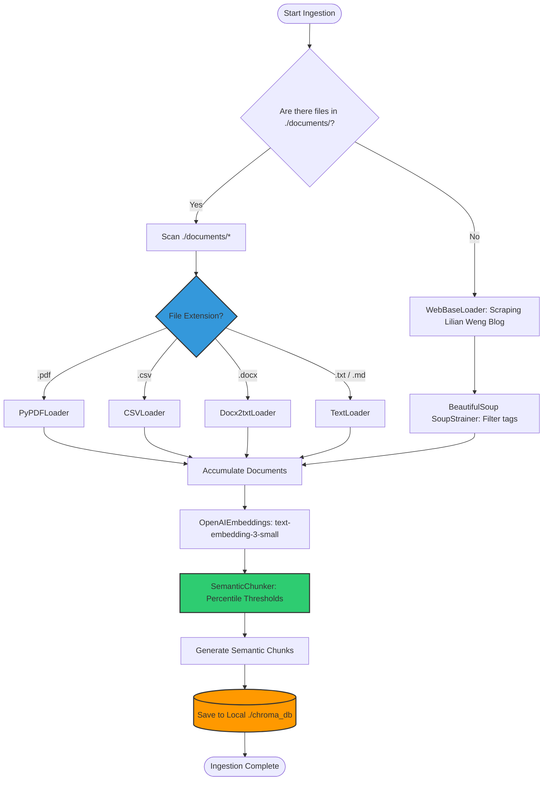
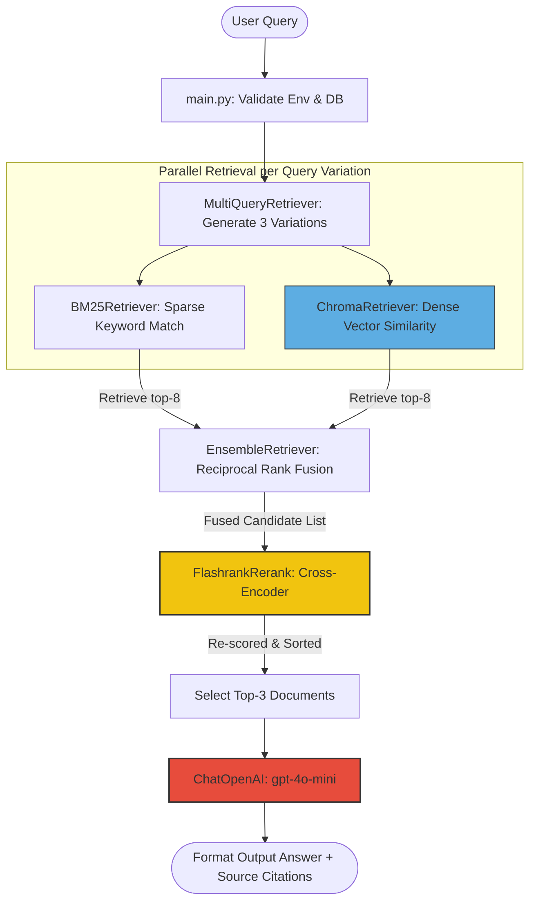
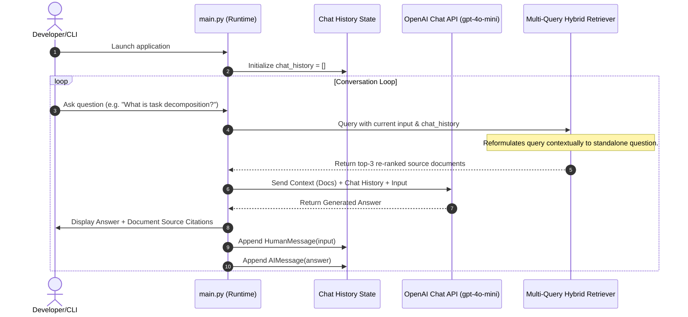

# 🌌 Advanced Local Conversational RAG System

<div align="center">


*An enterprise-ready, locally persisted Conversational RAG pipeline built on high-fidelity query optimizations, hybrid search indexes, and local cross-encoder re-ranking.*

&nbsp;

[](https://www.python.org/)
[](https://github.com/astral-sh/uv)
[](https://github.com/langchain-ai/langchain)
[](https://github.com/chroma-core/chroma)
[](LICENSE)

</div>

---

## 🗺️ Table of Contents
* [🪐 Project Overview](#-project-overview)
* [⚡ Key Capabilities](#-key-capabilities)
* [📈 Architecture & Data Flow](#-architecture--data-flow)
  * [1. Ingestion Pipeline](#1-data-ingestion-pipeline)
  * [2. Multi-Query Retrieval & Fusion](#2-multi-query-hybrid-retrieval-pipeline)
  * [3. Conversational Lifecycle](#3-request-lifecycle--conversational-memory)
* [📊 Baseline RAG vs. Advanced RAG](#-baseline-rag-vs-advanced-rag)
* [🛠️ Tech Stack](#️-tech-stack)
* [🚀 Getting Started](#-getting-started)
  * [Configuration (`.env`)](#configuration-env)
  * [Installation](#installation)
  * [Usage](#usage)
* [🔒 Security & Optimization](#-security--optimization)
* [📈 Monitoring](#-monitoring--observability)
* [📄 License](#-license)

---

## 🪐 Project Overview

Standard RAG architectures frequently fail when handling multi-format datasets, breaking critical contexts, or failing to identify specific keyword matches. 

This project addresses these challenges by implementing an **offline, high-recall, high-precision retrieval pipeline**. It digests mixed formats (PDFs, CSVs, Word files, Text) locally, divides content using vector-similarity boundaries (Semantic Chunking), translates inputs to bypass poorly phrased queries, and uses a local Cross-Encoder to re-rank the context before generating a final answer.

> [!IMPORTANT]  
> **Privacy by Design**: All embeddings, databases, and re-ranking calculations are computed **locally**. No document text ever leaves your machine; API calls are strictly limited to LLM inference.

---

## ⚡ Key Capabilities

* 📂 **Multi-Format Processing**: Routes PDFs (`PyPDFLoader`), CSVs (`CSVLoader`), Word files (`Docx2txtLoader`), and text documents directly from a local `./documents` folder.
* 🔮 **Intelligent Query Router**: An LLM-based structured classifier that dynamically routes incoming questions to the optimal translation technique (HyDE, Step-Back, Decomposition, RAG-Fusion, Multi-Query, or Standard retrieval) based on query style.
* 🧠 **Semantic Chunking**: Instead of static character-limit splits, the pipeline calculates similarity drift between consecutive sentences to keep related concepts together.
* 🔍 **Hybrid Query Matching**: Fuses vector similarity (dense search) with term-frequency index scanning (BM25 sparse search) to capture both concepts and exact keywords.
* ⚡ **Parallel Retrieval Execution**: Runs sub-queries concurrently via a Python ThreadPool executor to ensure near-zero latency overhead for multi-query strategies.
* 🎯 **Local Cross-Encoder Re-ranking**: Uses `Flashrank` to run local quantized Cross-Encoder scoring to keep only the top 3 most relevant context documents.
* 💬 **History-Aware Contextualization**: Translates conversational pronouns (e.g. *"What is task decomposition?"* $\rightarrow$ *"Give me an example of it"*) into self-contained search terms.
* 📚 **Fact-Checking Citations**: Every generated answer is paired with the exact source title, source URL, and a snippet preview.

---

## 📈 Architecture & Diagrams

### 1. Data Ingestion Pipeline


### 2. Multi-Query Hybrid Retrieval Pipeline


### 3. Request Lifecycle & Conversational Memory


---

## 📊 Baseline RAG vs. Advanced RAG

| Optimization Stage | Baseline RAG | Advanced RAG (This Project) | Impact |
| :--- | :--- | :--- | :--- |
| **Splitting** | Character Count (Fixed) | Semantic Similarity Splitter | Preserves thematic sentences together |
| **Retrieval** | Semantic Search only | Hybrid Search (Vector + BM25 Keyword) | Doesn't miss exact names/part numbers |
| **Translation** | Standard Query | Multi-Query Variation Generation | Resolves poorly phrased user questions |
| **Ordering** | Simple Vector Distance | Local Cross-Encoder Re-scoring | Eliminates context window noise |
| **Memory** | None (Single Turn) | Stateful Conversational History | Understands context of follow-ups |

---

## 🛠️ Tech Stack

* **Package Manager**: [uv](https://github.com/astral-sh/uv) (Rust-powered, ultra-fast Python environment sync)
* **LLM Engine**: OpenAI API (`gpt-4o-mini` & `text-embedding-3-small`)
* **Vector Store**: [Chroma DB](https://github.com/chroma-core/chroma)
* **Sparse Index**: [Rank-BM25](https://github.com/dorianbrown/rank_bm25)
* **Re-ranker Model**: [Flashrank](https://github.com/prithivida/flashrank) (runs locally using ONNX, zero API keys required)
* **Document Processing**: `pypdf`, `docx2txt`, `beautifulsoup4`, `tiktoken`

---

## 📂 Project Layout

```plaintext
rag_project/
│
├── .env.example        # Reference configurations (Template)
├── .gitignore          # Safeguards to prevent committing .env and chroma_db
├── pyproject.toml      # Modern PEP 518/621 project configuration managed by uv
├── requirements.txt    # Shared dependency list
│
├── ingest.py           # Scraping, parsing, chunking, and embedding database pipeline
├── query_processor.py  # Dynamic routing engine with all 5 query translation techniques
├── main.py             # User interface, database retriever load, and generation logic
├── playground.py       # Helper playground for similarity calculations and token sizes
│
├── documents/          # Directory where local PDFs, CSVs, and Word files are placed
└── chroma_db/          # Persistent local directory containing vector indices (Git ignored)
```

---

## 🚀 Getting Started

### Installation

1. **Clone the repository:**
   ```bash
   git clone https://github.com/Sh1vaay/RAG.git
   cd RAG
   ```

2. **Synchronize dependencies:**
   `uv` automatically configures your virtual environment and locks dependencies:
   ```bash
   uv sync
   ```

### Configuration (`.env`)

Copy the example configuration file:
```bash
cp .env.example .env
```
Open `.env` and fill in your keys:
```ini
OPENAI_API_KEY=sk-proj-YOUR_API_KEY
```

### Usage

1. **Populate Documents**: Place your PDFs, Word documents (`.docx`), CSVs, or text files into the `./documents` folder.
2. **Ingest Data**: Execute the parser and chunking pipeline to build the database:
   ```bash
   uv run ingest.py
   ```
3. **Launch the Chat CLI**: Run the interactive conversational loop:
   ```bash
   uv run main.py
   ```

---

## 🔒 Security & Optimization

* **Secrets Management**: Built-in protections inside `.gitignore` ensure `.env` and local database binary caches (`chroma_db/`) are blocked from version control.
* **Token Boundaries**: Semantic chunking breaks text without exceeding context-window limits, preventing model truncation and context cost bloat.
* **Fast Startup**: Hybrid search indexes are serialized and loaded from disk locally, bypassing repeated document scraping.

---

## 📈 Monitoring & Observability

This project includes integrations with **LangSmith** to inspect prompts, retrieval steps, latencies, and token costs:

```ini
LANGCHAIN_TRACING_V2=true
LANGCHAIN_API_KEY=ls__YOUR_LANGSMITH_API_KEY
LANGCHAIN_PROJECT="rag-local-assistant"
```

---

## 📄 License

This project is licensed under the MIT License. See [LICENSE](LICENSE) for details.
