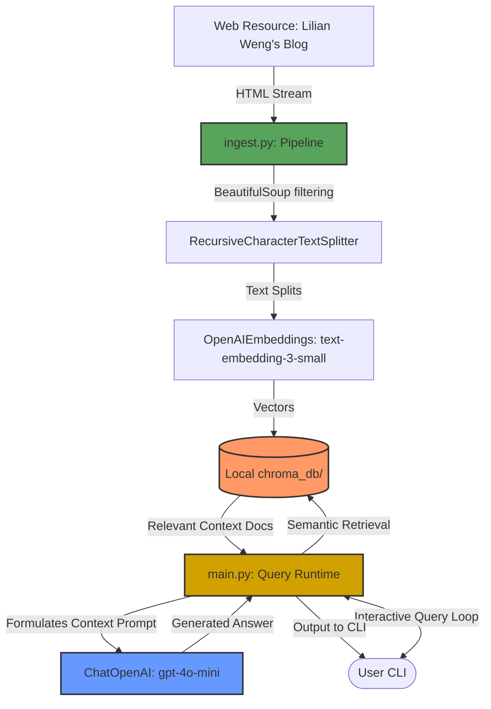
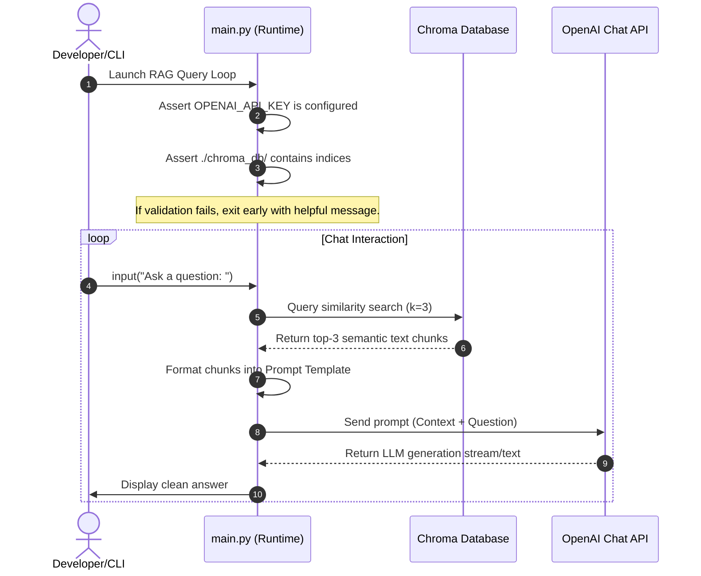

# Local RAG System (Retrieval-Augmented Generation)

[](https://www.python.org/)
[](https://github.com/astral-sh/uv)
[](https://github.com/langchain-ai/langchain)
[](https://github.com/chroma-core/chroma)
[](LICENSE)

An enterprise-ready, locally persisted Retrieval-Augmented Generation (RAG) system built with **LangChain**, **Chroma DB**, and **OpenAI**. This project demonstrates a production-grade directory separation of ingestion pipelines, runtime query engines, and token-cost estimation sandboxes, managed using the ultra-fast Python package manager `uv`.

---

## 📋 Table of Contents

- [Project Overview](#-project-overview)
- [Key Features](#-key-features)
- [Architecture & Data Flow](#-architecture--data-flow)
  - [System Architecture](#system-architecture)
  - [Application Flow (Request Lifecycle)](#application-flow-request-lifecycle)
- [Technology Stack](#-technology-stack)
- [Developer Experience & Setup](#-developer-experience--setup)
  - [Prerequisites](#prerequisites)
  - [Installation & Quick Start](#installation--quick-start)
  - [Configuration (`.env`)](#configuration-env)
- [Project Layout](#-project-layout)
- [Best Practices & Security](#-best-practices--security)
  - [Security Considerations](#security-considerations)
  - [Performance Optimizations](#performance-optimizations)
- [Monitoring & Observability](#-monitoring--observability)
- [Contributing](#-contributing)
- [License](#-license)

---

## 🔍 Project Overview

The objective of this project is to build a reliable local RAG CLI that extracts semantic knowledge from web sources (specifically Lilian Weng's *LLM-powered Autonomous Agents* article) and serves user queries without re-embedding data during every interaction.

### The Problem
Traditional LLMs suffer from knowledge cut-off limits and hallucination when asked about proprietary, domain-specific, or recently published data. 

### The Solution
By using a local Chroma database as a retriever, this system feeds the relevant parts of documents directly into the prompt context for the LLM. This provides:
* **Accuracy**: Answers strictly grounded in the provided documents.
* **Cost Efficiency**: Web scraping and embedding creation are run once as an ingestion phase, avoiding costly redundant API calls.
* **Low Latency**: Retrieve and generate responses using optimized local vector databases.

---

## ✨ Key Features

- **Decoupled Architecture**: Ingestion pipeline (`ingest.py`) is completely separated from runtime retrieval/inference (`main.py`).
- **Disk Persistence**: Vector indices are saved locally in `./chroma_db/`, allowing instant startup and persistent query capabilities.
- **Cost & Token Auditing**: A sandbox utility (`playground.py`) is included to compute token sizes and test semantic cosine similarity before writing items to disk.
- **Strict Guardrails**: Input validation alerts users to missing environment keys and empty database directories on launch.
- **Robust Parsing**: Fine-grained HTML parsing via BeautifulSoup soup strainers to filter out boilerplate elements (footers, navigation menus).

---

## 📐 Architecture & Data Flow

### System Architecture
The following diagram illustrates how the system modules interact with external web pages, database systems, and OpenAI APIs.



### Application Flow (Request Lifecycle)
The sequence diagram below shows how a single user request traverses the system lifecycle.



---

## 🛠 Technology Stack

* **Environment & Package Management**: [uv](https://github.com/astral-sh/uv) (built in Rust, fast package resolution)
* **Core Orchestrator**: [LangChain Core / Community](https://github.com/langchain-ai/langchain) (v1.0+)
* **Vector Store**: [Chroma DB](https://github.com/chroma-core/chroma)
* **LLM APIs**: OpenAI (Model: `gpt-4o-mini`)
* **Embedding Model**: OpenAI (Model: `text-embedding-3-small`)
* **Scraper & Parser**: BeautifulSoup4 & HTTPX client
* **Token Math**: `tiktoken` (using `cl100k_base` encoding) & NumPy (for cosine distance)

---

## 🚀 Developer Experience & Setup

### Prerequisites
* Python **3.12 or newer**
* **uv** package manager installed on your system. Run the installer script if you don't have it:
  ```bash
  # Linux / macOS
  curl -LsSf https://astral.sh/uv/install.sh | sh
  ```

### Installation & Quick Start

1. **Clone the repository:**
   ```bash
   git clone https://github.com/yourusername/rag-project.git
   cd rag-project
   ```

2. **Synchronize environment and install dependencies:**
   `uv` automatically installs dependencies from `pyproject.toml` into a local virtual environment:
   ```bash
   uv sync
   ```

3. **Configure Environment Variables:**
   Create your local `.env` configuration:
   ```bash
   cp .env.example .env
   ```
   Open the `.env` file and insert your API key:
   ```ini
   OPENAI_API_KEY=sk-proj-YOUR_REAL_OPENAI_API_KEY
   ```

4. **Verify the math sandbox (Optional):**
   Execute the playground script to verify token calculations and embedding workflows:
   ```bash
   uv run playground.py
   ```

5. **Run the Ingestion Pipeline:**
   Build the vector database locally (creates `./chroma_db/` folder):
   ```bash
   uv run ingest.py
   ```

6. **Start Querying the RAG CLI:**
   Interact with your documentation offline:
   ```bash
   uv run main.py
   ```

---

## 📂 Project Layout

```plaintext
rag_project/
│
├── .env.example        # Reference configurations (Template)
├── .gitignore          # Safeguards to prevent committing .env and chroma_db
├── pyproject.toml      # Modern PEP 518/621 project configuration managed by uv
├── requirements.txt    # Shared dependency list
│
├── ingest.py           # Scraping, parsing, chunking, and embedding database pipeline
├── main.py             # User interface, database retriever load, and generation logic
├── playground.py       # Helper playground for similarity calculations and token sizes
└── chroma_db/          # Persistent local directory containing vector indices (Git ignored)
```

---

## 🔒 Best Practices & Security

### Security Considerations
* **Secrets Exclusion**: The `.gitignore` is pre-configured to block `.env` file check-ins. Never commit secrets to version control.
* **API Validation**: Scripts fail fast with human-readable guidance when environment credentials are unset or configured with placeholders.
* **Scoped HTML Parsing**: Scrapers ignore script tags, styling nodes, and navigational headers. This limits prompt injections disguised within web boilerplate.

### Performance Optimizations
* **Optimized Models**: Embeddings use `text-embedding-3-small` which reduces network payloads and charges less than older models while retaining high semantic accuracy.
* **Token Boundaries**: The chunk size is bounded to 300 tokens using `RecursiveCharacterTextSplitter.from_tiktoken_encoder`, preventing context window overflow.
* **Local Caching**: The application avoids expensive HTTP lookups on startup; all retrievals query the locally persisted sqlite/parquet storage in `./chroma_db`.

---

## 📈 Monitoring & Observability

This project includes built-in hooks for **LangSmith**, providing observability and tracing into prompt pipelines, model latency, token usage, and retrieval scoring.

To enable full application tracing:
1. Register for an account at [smith.langchain.com](https://smith.langchain.com/).
2. Enable tracing in your `.env`:
   ```ini
   LANGCHAIN_TRACING_V2=true
   LANGCHAIN_API_KEY=ls__YOUR_LANGSMITH_API_KEY
   LANGCHAIN_PROJECT="rag-local-assistant"
   ```
3. Run `main.py` queries. All runs, token usage, and traces will be logged in your LangSmith dashboard automatically.

---

## 🤝 Contributing

Contributions are welcome! Please follow these steps:
1. Fork this repository.
2. Create a feature branch: `git checkout -b feature/amazing-feature`.
3. Commit your changes: `git commit -m 'Add some amazing feature'`.
4. Push to the branch: `git push origin feature/amazing-feature`.
5. Submit a Pull Request.

---

## 📄 License

This project is licensed under the MIT License. See [LICENSE](LICENSE) for details.
