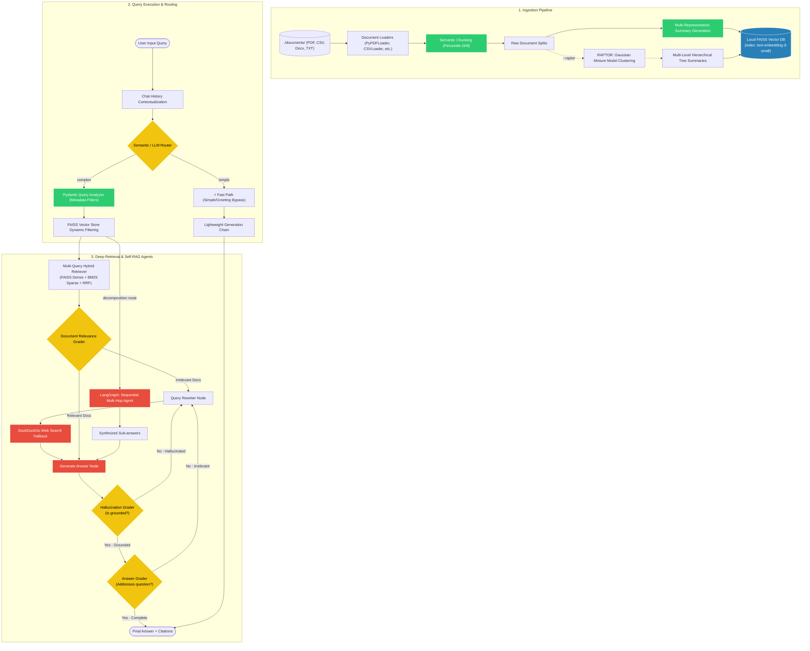
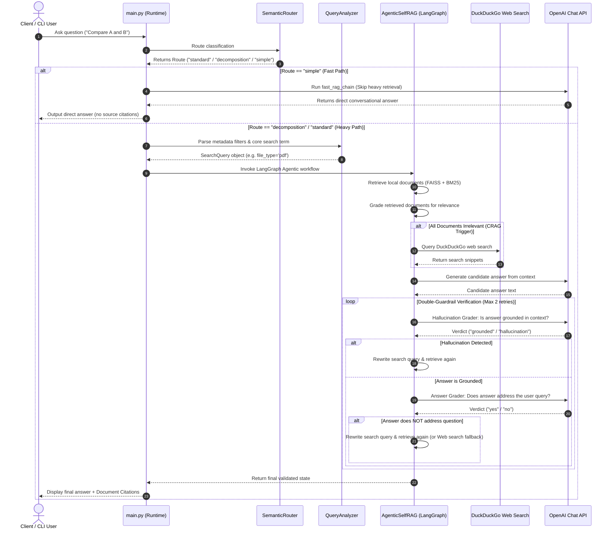

# 🌌 Advanced Local Conversational RAG System

<div align="center">

*An enterprise-ready, locally persisted Corrective & Self-Reflective Conversational RAG pipeline built on high-fidelity query optimizations and multi-agent LangGraph workflows.*

&nbsp;

[](https://www.python.org/)
[](https://github.com/astral-sh/uv)
[](https://github.com/langchain-ai/langchain)
[](https://github.com/facebookresearch/faiss)
[](LICENSE)

</div>

---

## 🗺️ Table of Contents
* [🪐 Project Overview](#-project-overview)
* [⚡ Key Capabilities](#-key-capabilities)
* [🏗️ System Architecture](#️-system-architecture)
* [🔄 Application Request Flow](#-application-request-flow)
* [🛠️ Tech Stack](#️-tech-stack)
* [📂 Project Layout](#-project-layout)
* [🚀 Getting Started](#-getting-started)
  * [Configuration (`.env`)](#configuration-env)
  * [Installation](#installation)
  * [Usage](#usage)
* [🔒 Security & Hardening](#-security--hardening)
* [📈 Performance & Scalability](#-performance--scalability)
* [📄 License](#-license)

---

## 🪐 Project Overview

Standard RAG architectures frequently suffer from retrieval noise, model hallucinations, and high latency when processing mixed datasets. 

This project implements an **Advanced Offline Conversational RAG Pipeline** designed for high recall, precision, and safety. It features:
* **Upfront Routing**: Instantly separates simple conversational tasks (Fast Path) from heavy multi-hop retrieval paths using an in-memory Semantic Router.
* **Robust Multi-Query Retrieval**: Executes hybrid dense (FAISS) and sparse (BM25) searches, and combines candidate documents using Reciprocal Rank Fusion (RRF).
* **Multi-Agent Orchestration**: Uses LangGraph workflows to decompose complex questions into sequential sub-tasks with memory tracking.
* **Double-Guardrail Self-RAG Loop**: Validates the correctness and usefulness of generated answers using an LLM evaluator to prevent hallucinations.
* **Corrective RAG (CRAG)**: Dynamically falls back to Google/DuckDuckGo web search if local document indexing lacks relevant facts.

---

## ⚡ Key Capabilities

* 📂 **Multi-Format Processing**: Routes PDFs (`PyPDFLoader`), CSVs (`CSVLoader`), Word files (`Docx2txtLoader`), and text documents directly from a local `./documents` folder.
* 🔮 **Configurable Dual-Routing Engine**: Features an in-memory embedding-based **Semantic Router** (zero-token latency) and an **LLM Router** (gpt-4o-mini structured output) to select optimal query translation strategies (HyDE, Step-Back, Decomposition, RAG-Fusion, Multi-Query, or Simple bypass).
* 🏷️ **Metadata Filtering & Temporal Analysis**: Dynamically extracts constraints like `publish_year`, `file_type`, `page_number`, and `data_source` corpus categories using Pydantic Query Analyzers. Relative time mentions (e.g., "last year") are resolved dynamically against the system clock.
* 🕸️ **LangGraph Query Decomposition**: Sequentially processes multi-hop questions using a cyclic state-graph workflow, updating sub-answers and search context dynamically.
* 🤖 **Corrective RAG (CRAG) Fallback**: Integrates LangChain's `DuckDuckGoSearchRun` to augment context with real-time web facts when retrieved local documents are evaluated as irrelevant.
* 🪞 **Double-Guardrail Evaluator (Self-RAG)**: 
  1. **Hallucination Grader**: Checks if the generated answer is fully grounded in the retrieved facts.
  2. **Answer Grader**: Validates if the answer actually addresses the user's original query. If validation fails, the loop triggers a search query rewrite and web search fallback.
* 📌 **Multi-Representation Indexing**: Summarizes raw chunks into clean one-line summaries at ingestion. The database indexes these summaries for optimal semantic alignment, but retrieval swaps them back to their original chunks to preserve rich context for generation.
* 🌲 **RAPTOR Tree Summaries** *(opt-in via `--raptor` flag)*: Recursively clusters document chunks and intermediate summaries using Gaussian Mixture Models (GMM) to build a multi-level tree of information (from detailed leaves to high-level root summaries), embedding all levels to answer broad, global queries.
* 🧠 **Semantic Chunking**: Computes semantic similarity drift between consecutive sentences to keep related concepts grouped together in cohesive chunks.
* 🔍 **Hybrid Query Matching**: Fuses dense similarity matching (FAISS) with term-frequency index scanning (BM25) to capture both semantic concepts and exact keywords.
* 🎯 **Configurable Reranking**: Supports local Cross-Encoder scoring via `Flashrank`, or cloud-based `Cohere Rerank` integration, selectable in the environment configuration.

---

## 🏗️ System Architecture

The following diagram illustrates the components, indices, services, and execution logic of the system:



---

## 🔄 Application Request Flow

The diagram below maps the runtime lifecycle of a user query through the system's routing decision trees and Self-RAG loops:



---

## 🛠️ Tech Stack

* **Package Manager**: [uv](https://github.com/astral-sh/uv) (Rust-powered, ultra-fast Python environment sync)
* **Orchestration**: [LangChain](https://github.com/langchain-ai/langchain) & [LangGraph](https://github.com/langchain-ai/langgraph)
* **LLM Engine**: OpenAI API (`gpt-4o-mini` & `text-embedding-3-small`)
* **Vector Store**: [FAISS](https://github.com/facebookresearch/faiss) (Lightweight, local, network-vulnerability-free vector library)
* **Sparse Index**: [Rank-BM25](https://github.com/dorianbrown/rank_bm25)
* **Re-ranker Model**: [Flashrank](https://github.com/prithivida/flashrank) (Quantized cross-encoder model running locally via ONNX)
* **Document Parsing**: `pypdf`, `docx2txt`, `beautifulsoup4`, `tiktoken`

---

## 📂 Project Layout

```plaintext
rag_project/
├── .env.example            # Reference configurations (Template)
├── .gitignore              # Git ignore rules for virtual environments, .env and db
├── pyproject.toml          # Modern PEP 621 project configuration managed by uv
├── requirements.txt        # Exported dependency lockfile
│
├── ingest.py               # Scraping, semantic parsing, Multi-Rep + RAPTOR building
├── query_processor.py      # Dynamic semantic embedding router & Pydantic analyzer
├── decomposition_graph.py  # LangGraph multi-hop sequential decomposition agent
├── agentic_graph.py        # LangGraph CRAG + Self-RAG Double-Guardrail agent
├── multi_rep_utils.py      # Multi-Representation Indexing utilities
├── main.py                 # CLI interface, pipeline runner, and conversational loop
└── playground.py           # Local helper script for testing embeddings & similarities
```

---

## 🚀 Getting Started

### Installation

1. **Clone the repository:**
   ```bash
   git clone https://github.com/Sh1vaay/RAG.git
   cd RAG
   ```

2. **Synchronize dependencies:**
   `uv` automatically configures your virtual environment and locks dependencies:
   ```bash
   uv sync
   ```

### Configuration (`.env`)

Copy the example configuration file:
```bash
cp .env.example .env
```
Open `.env` and configure your settings:
```ini
OPENAI_API_KEY=sk-proj-YOUR_API_KEY

# Routing configuration: 'semantic' (Fast/Free similarity matching) or 'llm' (Structured reasoning)
ROUTING_METHOD=semantic

# Reranker selection: 'flashrank' (local ONNX Cross-Encoder) or 'cohere' (Cloud Rerank API)
RERANKER_PROVIDER=flashrank
```

### Usage

1. **Populate Documents**: Place your PDFs, Word documents (`.docx`), CSVs, or text files into the `./documents` folder.
2. **Ingest Data**: Execute the parser and chunking pipeline to build the database:
   ```bash
   # Build index using Multi-Rep indexing
   uv run ingest.py

   # Build index using Multi-Rep + RAPTOR hierarchical tree summaries
   uv run ingest.py --raptor
   ```
3. **Launch the Chat CLI**: Run the interactive conversational loop:
   ```bash
   uv run main.py
   ```

---

## 🔒 Security & Hardening

* **Local Sandbox Boundary**: The SQLite FAISS database, semantic indices, and re-ranking tasks are kept local. Document content is only sent to OpenAI for LLM inference (not for embeddings or database hosting).
* **Vulnerable Dependency Avoidance**: The project dependencies contain no external pickling/caching libraries (`diskcache`) or multi-modal faithfulness evaluation modules (`ragas`), completely eliminating vulnerabilities such as CVE-2025-69872 and CVE-2025-45691.
* **Secrets Management**: Built-in rules in `.gitignore` ensure your `.env` configuration file and local `faiss_db/` folder are never committed to version control.

---

## 📈 Performance & Scalability

* **Parallel Execution**: Retrieval queries for RAG-fusion, Multi-Query, and step-back abstractions are resolved concurrently in a `ThreadPoolExecutor` to optimize API latency.
* **In-Memory Semantic Routing**: Simple queries bypass the heavy RAG pipelines entirely, resolving in <15ms without LLM latency or token overhead.
* **Quantized Reranking**: By default, `Flashrank` utilizes local quantized ONNX weights, allowing Cross-Encoder scoring to run inside CPU constraints with negligible RAM overhead.

---

## 📄 License

This project is licensed under the MIT License. See the [LICENSE](LICENSE) file for details.
