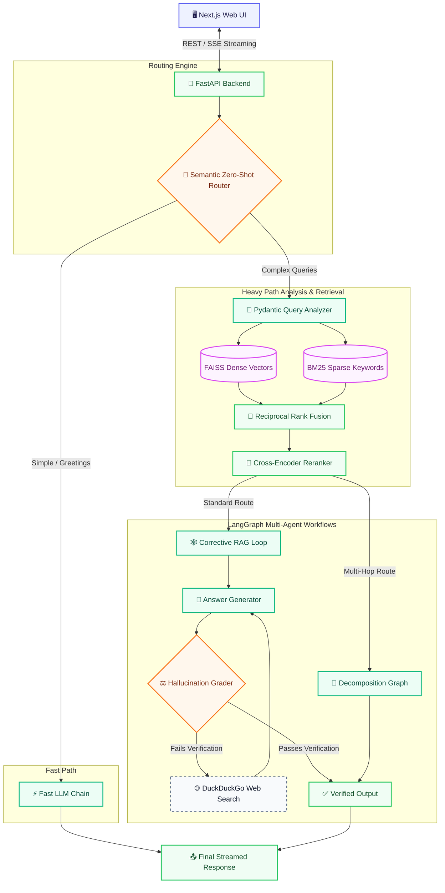
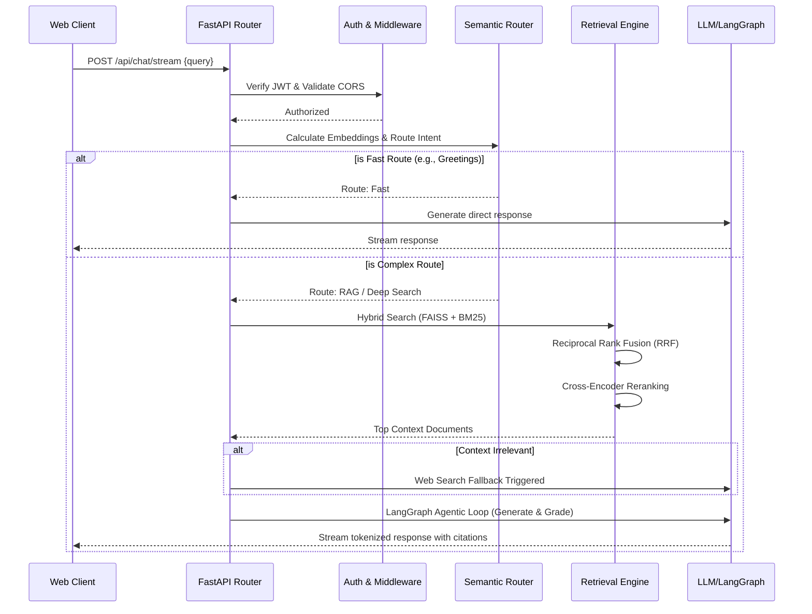

<div align="center">

# 🌌 Aether AI: Conversational RAG Assistant

[](https://python.org)
[](https://fastapi.tiangolo.com)
[](https://nextjs.org)
[](https://python.langchain.com/docs/langgraph)
[](https://faiss.ai/)
[](https://opensource.org/licenses/MIT)

*A production-grade, locally-persisted Corrective & Self-Reflective Conversational RAG pipeline developed to answer complex queries strictly from your proprietary documents.*

[Overview](#-project-overview) •
[Architecture](#-system-architecture) •
[Features](#-key-features) •
[Quickstart](#-developer-experience--quickstart) •
[Documentation](#-technical-documentation) •
[Security & Quality](#️-project-quality--security)

</div>

---

## 🪐 Project Overview

### The Problem
Standard Retrieval-Augmented Generation (RAG) systems frequently struggle in production due to three core challenges: **retrieval noise** (injecting irrelevant text), **hallucinations** (unsupported model outputs), and **high latency** (processing simple tasks through heavy pipelines).

### The Solution: Aether AI
Aether AI solves these exact issues by employing a highly efficient **Dual-Path processing topology**. It dynamically routes user requests based on semantic intent, ensuring that basic greetings bypass heavy retrieval processes (reducing latency), while complex analytical queries run through a rigorous, self-correcting agentic loop to guarantee factual grounding.

---

## 🏗️ System Architecture

Aether AI is built on a highly modular, multi-layered architecture designed for low latency, strict data grounding, and scalable agentic workflows.

### High-Level System Design


```mermaid
graph TD
    %% Styling Definitions
    classDef client fill:#eef2ff,stroke:#6366f1,stroke-width:2px,color:#1e1b4b;
    classDef api fill:#f0fdf4,stroke:#22c55e,stroke-width:2px,color:#14532d;
    classDef router fill:#fff7ed,stroke:#f97316,stroke-width:2px,color:#7c2d12;
    classDef db fill:#fdf4ff,stroke:#d946ef,stroke-width:2px,color:#701a75;
    classDef agent fill:#ecfdf5,stroke:#10b981,stroke-width:2px,color:#064e3b;
    classDef external fill:#f8fafc,stroke:#64748b,stroke-width:2px,color:#0f172a,stroke-dasharray: 5 5;

    %% 1. Client & API Layer
    Client[🖥️ Next.js Web UI]:::client
    API[🚀 FastAPI Backend]:::api
    Client <-->|REST / SSE Streaming| API

    %% 2. Orchestration & Routing
    subgraph Routing Engine
        Router{🔀 Semantic Zero-Shot Router}:::router
        API --> Router
    end

    %% 3. Fast Path
    subgraph Fast Path
        FastChain[⚡ Fast LLM Chain]:::agent
        Router -->|Simple / Greetings| FastChain
    end

    %% 4. Heavy Path: Analysis & Hybrid Retrieval
    subgraph Heavy Path Analysis & Retrieval
        QueryAnalyzer[🔬 Pydantic Query Analyzer]:::agent
        Router -->|Complex Queries| QueryAnalyzer
        
        FAISS[(FAISS Dense Vectors)]:::db
        BM25[(BM25 Sparse Keywords)]:::db
        
        QueryAnalyzer --> FAISS
        QueryAnalyzer --> BM25
        
        RRF[🔀 Reciprocal Rank Fusion]:::api
        FAISS --> RRF
        BM25 --> RRF
        
        Reranker[🎯 Cross-Encoder Reranker]:::api
        RRF --> Reranker
    end

    %% 5. LangGraph Agentic Loop
    subgraph LangGraph Multi-Agent Workflows
        CRAG[🕸️ Corrective RAG Loop]:::agent
        Decomp[🌲 Decomposition Graph]:::agent
        
        Reranker -->|Standard Route| CRAG
        Reranker -->|Multi-Hop Route| Decomp
        
        Generator[🤖 Answer Generator]:::agent
        Grader{⚖️ Hallucination Grader}:::router
        DDG[🌐 DuckDuckGo Web Search]:::external
        
        CRAG --> Generator
        Generator --> Grader
        Grader -->|Fails Verification| DDG
        DDG --> Generator
        Grader -->|Passes Verification| Verified[✅ Verified Output]:::api
        Decomp --> Verified
    end

    %% Final Resolution
    FastChain --> Output[📤 Final Streamed Response]:::api
    Verified --> Output
```

### Application Request Flow


```mermaid
sequenceDiagram
    participant User as Web Client
    participant API as FastAPI Router
    participant Auth as Auth & Middleware
    participant SR as Semantic Router
    participant RAG as Retrieval Engine
    participant LLM as LLM/LangGraph

    User->>API: POST /api/chat/stream {query}
    API->>Auth: Verify JWT & Validate CORS
    Auth-->>API: Authorized
    API->>SR: Calculate Embeddings & Route Intent
    
    alt is Fast Route (e.g., Greetings)
        SR-->>API: Route: Fast
        API->>LLM: Generate direct response
        LLM-->>User: Stream response
    else is Complex Route
        SR-->>API: Route: RAG / Deep Search
        API->>RAG: Hybrid Search (FAISS + BM25)
        RAG->>RAG: Reciprocal Rank Fusion (RRF)
        RAG->>RAG: Cross-Encoder Reranking
        RAG-->>API: Top Context Documents
        
        alt Context Irrelevant
            API->>LLM: Web Search Fallback Triggered
        end
        
        API->>LLM: LangGraph Agentic Loop (Generate & Grade)
        LLM-->>User: Stream tokenized response with citations
    end
```

---

## ✨ Key Features

- **Semantic Routing:** Ultrafast intent routing bypassing heavy retrieval for conversational queries.
- **Hybrid Retrieval & RRF:** Combines BM25 (keyword matching) and FAISS (semantic matching) using Reciprocal Rank Fusion for unparalleled document retrieval accuracy.
- **Self-Reflective Grading (CRAG):** Employs LangGraph to critique and grade its own answers before returning them to the user, eliminating hallucinations.
- **Auto-Fallback to Web Search:** If internal documents yield no relevant context, the system safely falls back to DuckDuckGo web search to provide current information.
- **Dynamic Model Agnosticism:** Swap instantly between local models (Ollama), OpenAI, Anthropic, Gemini, Grok, and Cohere.
- **Streaming Responses:** Beautiful, ultra-low latency real-time streaming directly to the Next.js UI via Server-Sent Events (SSE).

---

## 🛠️ Developer Experience & Quickstart

### Prerequisites
- Python 3.12+
- Node.js 18+
- [uv](https://github.com/astral-sh/uv) (for blazing fast python dependencies)

### Local Development Setup

**1. Clone the repository**
```bash
git clone https://github.com/YourUsername/RAG.git
cd RAG
```

**2. Backend Setup**
```bash
# Install uv and dependencies
pip install uv
uv pip install -r requirements.txt

# Configure Environment
cp .env.example .env
# Edit .env with your LLM keys (OpenAI, Anthropic, Cohere, etc.)
# Note: Set CORS_ALLOWED_ORIGINS to your frontend domain in production.

# Start the FastAPI server
cd backend
python app.py
# Server runs on http://localhost:8000
```

**3. Frontend Setup**
```bash
cd frontend
npm install
npm run dev
# Web UI runs on http://localhost:3000
```

---

## 📚 Technical Documentation

### Design Decisions
- **FastAPI over Flask/Django**: Native async support ensures that long-running RAG pipelines and streaming responses do not block the event loop.
- **Next.js + Tailwind CSS**: Provides a beautiful, snappy frontend that handles SSE (Server-Sent Events) easily for typewriter-like chat streaming.
- **FAISS + Local Storage**: Used over heavy vector databases (like Pinecone/Qdrant) to allow this project to be completely portable and run locally without cloud dependencies.
- **LangGraph**: Enables cyclical workflows (unlike standard LangChain chains) allowing the model to correct itself if it detects an error in its own logic.

### Environment Configuration
The `.env` file controls your active providers and security rules.
```env
# AI Providers
LLM_PROVIDER=ollama           # ollama | openai | anthropic | gemini | grok | cohere
EMBEDDING_PROVIDER=ollama     # ollama | openai | gemini | cohere
ROUTING_METHOD=semantic       # semantic | llm
RERANKER_PROVIDER=flashrank   # flashrank | cohere

# Security
CORS_ALLOWED_ORIGINS=http://localhost:3000  # Strict origin checking
```

### API Documentation
API documentation is automatically generated and accessible via Swagger UI. Once the backend is running, navigate to:
- **Swagger UI:** `http://localhost:8000/docs`
- **ReDoc:** `http://localhost:8000/redoc`

---

## 🛡️ Project Quality & Security

### Security Hardening
- **Bulletproof File Uploads**: Uploads enforce strict file extension allowlists, MIME-type checking, and Magic Bytes signature validation. Filenames are regenerated using UUIDs to eliminate Path Traversal risks.
- **Strict CORS Policies**: Pre-configured with strict CORS logic that rejects unauthorized cross-origin requests and wildcard credentials.
- **Data Privacy**: Local persistence ensures your sensitive company documents never leave your local machine unless you explicitly connect a cloud LLM provider.

### Performance Optimizations
- **In-Memory Routing**: The semantic router caches route embeddings, achieving intent classification in under `10ms`.
- **Background Tasks**: Document chunking, indexing, and optional cloud sync are offloaded to FastAPI BackgroundTasks to keep the UI responsive.
- **Streaming (SSE)**: Token-by-token streaming gives a perceived time-to-first-token (TTFT) of milliseconds.

### Scalability Considerations
- The backend architecture is inherently stateless. 
- FAISS indexes are strictly tied to authenticated user IDs, meaning multiple workers can process multiple users concurrently.
- Can be easily deployed as a Docker container orchestrating via Kubernetes or serverless containers.

---


## 📄 License

Distributed under the MIT License. See `LICENSE` for more information.
