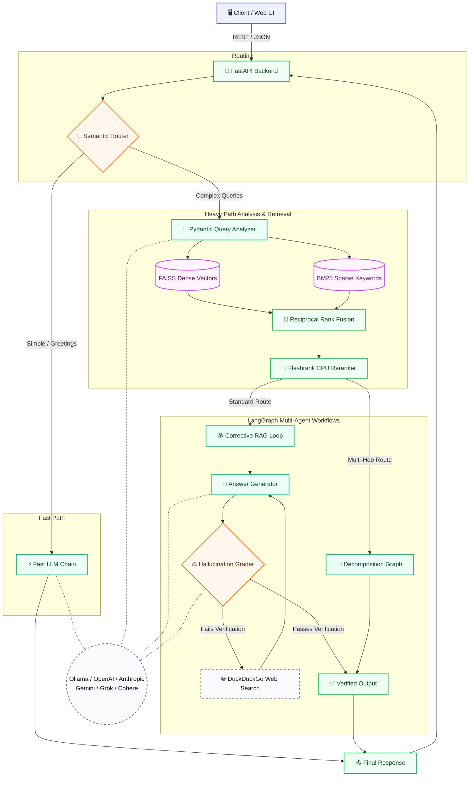

# 🌌 Aether AI: Conversational RAG Assistant

<div align="center">


*A production-grade, locally-persisted Corrective & Self-Reflective Conversational RAG pipeline developed to answer complex queries strictly from company documents.*

</div>

---

## 🪐 Project Overview

Standard Retrieval-Augmented Generation (RAG) systems frequently struggle in production due to three core challenges: **retrieval noise** (injecting irrelevant text), **hallucinations** (unsupported model outputs), and **high latency** (processing simple tasks through heavy pipelines).

This project solves these exact issues by employing a highly efficient **Dual-Path processing topology**:

1. **The Fast Path (Low-Latency Bypass)**: Simple inputs, greetings, or direct conversation bypass heavy vector stores entirely using an in-memory embedding-based **Semantic Router**, routing queries to a lightweight conversational agent in milliseconds.
2. **The Heavy Path (Self-Reflective Agents)**: Complex queries are routed to specialized pipelines where Pydantic Query Analyzers parse constraints. Retrieval combines dense (FAISS) and sparse (BM25) search indices via Reciprocal Rank Fusion (RRF), followed by a multi-agent **LangGraph** self-correcting loop. Final answers are strictly validated against hallucinations.

---

## 🏗️ Detailed System Architecture

Aether AI is built on a highly modular, multi-layered architecture designed for low latency, strict data grounding, and scalable agentic workflows. 


```mermaid
graph TD
    %% Styling Definitions
    classDef client fill:#eef2ff,stroke:#6366f1,stroke-width:2px,color:#1e1b4b;
    classDef api fill:#f0fdf4,stroke:#22c55e,stroke-width:2px,color:#14532d;
    classDef router fill:#fff7ed,stroke:#f97316,stroke-width:2px,color:#7c2d12;
    classDef db fill:#fdf4ff,stroke:#d946ef,stroke-width:2px,color:#701a75;
    classDef agent fill:#ecfdf5,stroke:#10b981,stroke-width:2px,color:#064e3b;
    classDef external fill:#f8fafc,stroke:#64748b,stroke-width:2px,color:#0f172a,stroke-dasharray: 5 5;

    %% 1. Client & API Layer
    Client[🖥️ Client / Web UI]:::client
    API[🚀 FastAPI Backend]:::api
    Client -->|REST / JSON| API

    %% 2. Orchestration & Routing
    subgraph Routing
        Router{🔀 Semantic Router}:::router
        API --> Router
    end

    %% 3. Fast Path
    subgraph Fast Path
        FastChain[⚡ Fast LLM Chain]:::agent
        Router -->|Simple / Greetings| FastChain
    end

    %% 4. Heavy Path: Analysis & Hybrid Retrieval
    subgraph Heavy Path Analysis & Retrieval
        QueryAnalyzer[🔬 Pydantic Query Analyzer]:::agent
        Router -->|Complex Queries| QueryAnalyzer
        
        FAISS[(FAISS Dense Vectors)]:::db
        BM25[(BM25 Sparse Keywords)]:::db
        
        QueryAnalyzer --> FAISS
        QueryAnalyzer --> BM25
        
        RRF[🔀 Reciprocal Rank Fusion]:::api
        FAISS --> RRF
        BM25 --> RRF
        
        Reranker[🎯 Flashrank CPU Reranker]:::api
        RRF --> Reranker
    end

    %% 5. LangGraph Agentic Loop
    subgraph LangGraph Multi-Agent Workflows
        CRAG[🕸️ Corrective RAG Loop]:::agent
        Decomp[🌲 Decomposition Graph]:::agent
        
        Reranker -->|Standard Route| CRAG
        Reranker -->|Multi-Hop Route| Decomp
        
        Generator[🤖 Answer Generator]:::agent
        Grader{⚖️ Hallucination Grader}:::router
        DDG[🌐 DuckDuckGo Web Search]:::external
        
        CRAG --> Generator
        Generator --> Grader
        Grader -->|Fails Verification| DDG
        DDG --> Generator
        Grader -->|Passes Verification| Verified[✅ Verified Output]:::api
        Decomp --> Verified
    end

    %% Final Resolution
    FastChain --> Output[📤 Final Response]:::api
    Verified --> Output
    Output --> API
    
    %% External Services
    LLM((Ollama / OpenAI / Anthropic<br/>Gemini / Grok / Cohere)):::external
    FastChain -.- LLM
    QueryAnalyzer -.- LLM
    Generator -.- LLM
    Grader -.- LLM
```

### 🔹 Layer-by-Layer Breakdown

1. **Client & API Layer (FastAPI)**: Serves `/api/chat`, `/api/upload`, `/api/ingest`, `/api/config`, `/api/status` and `/api/providers`, all requiring a verified Supabase session when auth is configured. Handles CORS, payload validation, and serves the Next.js static export.
2. **Orchestration & Routing (Semantic Router)**: Immediately evaluates the query against predefined semantic boundaries. If the query is conversational (e.g., "Hello", "Thanks"), it bypasses the database entirely, reducing API cost and latency to `< 500ms`.
3. **Query Analysis (Pydantic & LLM)**: For complex queries, a structured LLM extracts constraints (e.g., `publish_year > 2022`, `file_type: PDF`). These constraints are transformed into strict metadata filters for the vector stores.
4. **Hybrid Retrieval & Reranking Engine**: 
   - **FAISS (Dense)**: Retrieves documents conceptually related to the query.
   - **BM25 (Sparse)**: Ensures exact keyword matches (vital for serial numbers or acronyms).
   - **RRF & Flashrank**: Combines both streams via Reciprocal Rank Fusion and re-ranks them locally on the CPU using cross-encoder models, ensuring only the highest-fidelity context reaches the agent.
5. **Agentic Workflows (LangGraph)**:
   - **Corrective RAG (CRAG)**: Generates a draft answer and grades it for hallucinations. If the draft contains ungrounded claims, it dynamically triggers DuckDuckGo web search to gather missing facts, re-writes the context, and tries again.
   - **Decomposition**: For multi-faceted questions, the graph recursively breaks the problem into sub-questions, answering them sequentially before synthesizing a final response.

---

## 🔄 Application Flow (Request Lifecycle)


```mermaid
sequenceDiagram
    participant User
    participant Router as Semantic Router
    participant DB as Vector Stores
    participant Agent as LangGraph Agent
    participant LLM as Ollama (local)
    
    User->>Router: What is the Q1 revenue?
    Router-->>Router: Computes Cosine Similarity
    
    alt is Simple Query
        Router->>LLM: Direct Chat Prompt
        LLM-->>User: Immediate Response (< 500ms)
    else is Complex Query
        Router->>DB: Extract Metadata & Execute Hybrid Search
        DB-->>Agent: Return Top-K Chunks
        
        loop Corrective RAG (CRAG)
            Agent->>LLM: Generate Answer based on Chunks
            LLM-->>Agent: Draft Answer
            Agent->>LLM: Grade Answer for Hallucinations
            
            alt Passes Verification
                LLM-->>User: Fully Grounded Answer
            else Fails Verification
                Agent->>Agent: Trigger Web Search Fallback
                Agent->>DB: Re-write Query & Re-Retrieve
            end
        end
    end
```

---

## ⚡ Key Features

* 🔮 **Dual-Routing Switchboard**: Supports embedding-based local **Semantic Routing** (zero-token latency, in-memory) to classify query intent instantly.
* 🔬 **Pydantic Query Analyzer**: Automatically extracts database metadata filters (e.g., `publish_year`, `file_type`, `page_number`) to build strict queries.
* 🔀 **Hybrid Retrieval (RRF)**: Combines dense vector retrieval (FAISS) and sparse keyword retrieval (BM25) using Reciprocal Rank Fusion to ensure both semantic capture and exact keyword matches.
* 🕸️ **LangGraph Multi-Hop Decomposition**: Breaks complex, multi-faceted questions into sequential sub-questions, answering them one-by-one using intermediate context memory.
* 🌐 **Corrective RAG (CRAG)**: Grades retrieved documents and dynamically triggers DuckDuckGo web search to gather missing facts when local context is insufficient.
* 🪞 **Double-Guardrail Self-RAG Evaluator**: Uses a two-step validation chain (Hallucination Grader + Answer Relevance Grader) to run verification loops.
* ✂️ **Semantic Chunking**: Identifies meaning-based boundaries by tracking semantic drift across adjacent sentences, preventing paragraph truncation.
* 🎯 **Flashrank CPU Reranking**: Re-ranks candidates locally on CPU using optimized quantized cross-encoder models.
* 🌍 **Graceful General-Knowledge Fallback**: When retrieval surfaces nothing relevant, the assistant answers from general knowledge instead of refusing — and the reply is explicitly labelled *"general knowledge — not your documents"* so a grounded answer is never confused with an ungrounded one.
* 🔐 **Supabase Authentication**: Email sign-in/sign-up. Access tokens are verified locally against the project's public JWKS (ES256), so the backend needs no JWT secret and no service-role key.
* 🏢 **Per-User Workspaces**: Every account gets its own documents, its own FAISS index and its own provider settings. The user id comes from the verified `sub` claim and nowhere else.
* 🎛️ **Six Interchangeable Providers**: Ollama, OpenAI, Anthropic, Gemini, Grok and Cohere. The chat model and the embedding model are chosen **independently**, because Anthropic and Grok publish no embeddings API.
* ☁️ **Supabase Cloud Sync**: Documents, FAISS indices and encrypted user configuration sync to Supabase Storage, isolated by Row-Level Security rather than a privileged service key.

---

## 📂 Project Structure & Evolution

This repository contains both the final production-ready system and the original prototypes from the first phase of the development lifecycle:

```text
├── backend/              # (ACTIVE) Aether AI engine — FastAPI, LangGraph, FAISS
│   ├── app.py            #   Routes, per-user pipeline cache, auth wiring
│   ├── auth.py           #   Supabase JWT verification against the project JWKS
│   ├── workspace.py      #   Per-user path resolution + Storage sync
│   ├── providers.py      #   The six-provider factory (explicit config, no globals)
│   ├── user_config.py    #   Per-user settings; API keys encrypted at rest
│   ├── storage.py        #   Supabase Storage client (acts as the signed-in user)
│   ├── main.py           #   setup_pipeline: retrievers, reranker, chains
│   ├── ingest.py         #   Indexing CLI (semantic chunking, multi-rep, RAPTOR)
│   └── query_processor.py, agentic_graph.py, decomposition_graph.py, multi_rep_utils.py
├── frontend/             # (ACTIVE) Next.js 16 + shadcn/ui dashboard
├── workspaces/           # (RUNTIME) Per-user documents and indexes — gitignored
├── tests/                # (ACTIVE) Pytest suite
├── data/                 # (ACTIVE) Source PDFs and CSVs used to generate samples
├── eval/                 # (ACTIVE) Golden JSON sets for faithfulness scoring
├── evaluate.py           # (ACTIVE) Evaluation harness
├── prototype_v1/         # (ARCHIVE) Original TF-IDF/ChromaDB scripts
├── .github/              # CI: ruff, compileall, pytest
└── Dockerfile            # Containerization for the backend
```

> **Note**: The `prototype_v1/` directory contains legacy scripts from early development stages, preserved for historical context.

---

## 🛠️ Developer Setup & Experience

### 1. Environment Setup

Clone the repository and install dependencies using `uv` (a much faster pip alternative):

```bash
git clone https://github.com/yourusername/aether-ai.git
cd aether-ai

# Install dependencies
uv venv
source .venv/bin/activate
uv pip install -r requirements.txt
```

Create a `.env` file from the example:
```bash
cp .env.example .env
```

**No LLM API keys are required.** By default the chat model and the embedding model
both run locally through [Ollama](https://ollama.com), and the reranker (Flashrank)
runs on CPU. Pull the two default models once and leave the daemon running:
```bash
ollama pull llama3.2:1b
ollama pull nomic-embed-text
```

Swap providers with `LLM_PROVIDER` / `EMBEDDING_PROVIDER` and override the model with
`LLM_MODEL` / `EMBEDDING_MODEL` — in `.env`, or per-user from the Settings tab. No code
change either way.

> **Authentication is optional.** Leave `NEXT_PUBLIC_SUPABASE_URL` unset and the app
> runs single-user against a shared `local` workspace with no sign-in. Set it, and every
> `/api/*` route requires a Supabase session and each account gets its own workspace.

### 2. Building the Index
Upload documents from the dashboard, or index a workspace directly:

```bash
python -m backend.ingest --user local        # add --raptor for the cluster tree
```

### 3. Starting the Server

```bash
uvicorn backend.app:app --host 0.0.0.0 --port 8000
```

Prefer this over `python -m backend.app`: that entrypoint enables `--reload`, and on
Windows the reloader spawns worker processes that outlive the parent, holding the port
and serving stale code.

The frontend is a Next.js static export served by the same process. Build it once:

```bash
cd frontend && npm install && npm run build   # emits frontend/out
```

For UI work, `npm run dev` on port 3000 hot-reloads against the same API; point it at the
backend with `NEXT_PUBLIC_API_BASE` in `frontend/.env.local`.

### 4. Running Evaluations & Tests
To view the accuracy metrics and system faithfulness (verifying the jump from the flawed v1 to the fixed v2 golden set):

```bash
python evaluate.py
```
To run the automated CI pipeline tests:
```bash
pytest tests/
```

---

## 🐳 Docker Deployment

The backend ships as a slim Python image. The frontend is built separately and either
served from `frontend/out` or deployed on its own host.

```bash
# Build the image
docker build -t aether-ai .

# Run the container. No API keys — but point it at the Ollama daemon on the host,
# since `localhost` inside the container is the container itself.
docker run -p 8000:8000 \
    -e OLLAMA_BASE_URL="http://host.docker.internal:11434" \
    aether-ai
```
*(Note: `.dockerignore` excludes the raw `data/` folder, the frontend build inputs and
`workspaces/` — which is mounted as a persistent volume in production rather than baked
into the image.)*

---

## 🔒 Security & Quality Assurances

* **Identity is never client-supplied**: the workspace and every Storage prefix derive
  from the JWT's verified `sub` claim, not from any request body, header or query string.
* **No service-role key exists in this app**: the backend acts *as the signed-in user*, so
  Supabase Row-Level Security is the actual isolation mechanism rather than defence-in-depth
  that a forgotten `WHERE` clause could bypass.
* **Local JWT verification**: access tokens are checked against the project's public JWKS
  (ES256). A token signed with any other key is rejected, and an unknown key id returns
  401 rather than a misleading 503.
* **Path traversal protection**: user ids are matched against a strict pattern and the
  resolved workspace path is asserted to sit inside the workspace root; uploaded filenames
  are reduced to their basename.
* **API keys encrypted at rest**: per-user credentials are stored Fernet-encrypted, never
  returned by any endpoint, and never written to the process environment.
* **Grounding is labelled, not assumed**: replies that fall back to general knowledge are
  marked as such and carry no citations.

> **Known gap**: the container currently runs as **root**. The non-root `appuser` is
> commented out in the `Dockerfile` so that Railway's persistent volume at
> `/app/workspaces` stays writable. Fix by pre-creating the volume with matching
> ownership, then re-enabling the `USER` directive.

---

> **Built with passion to push the boundaries of Local Corrective RAG systems.**
