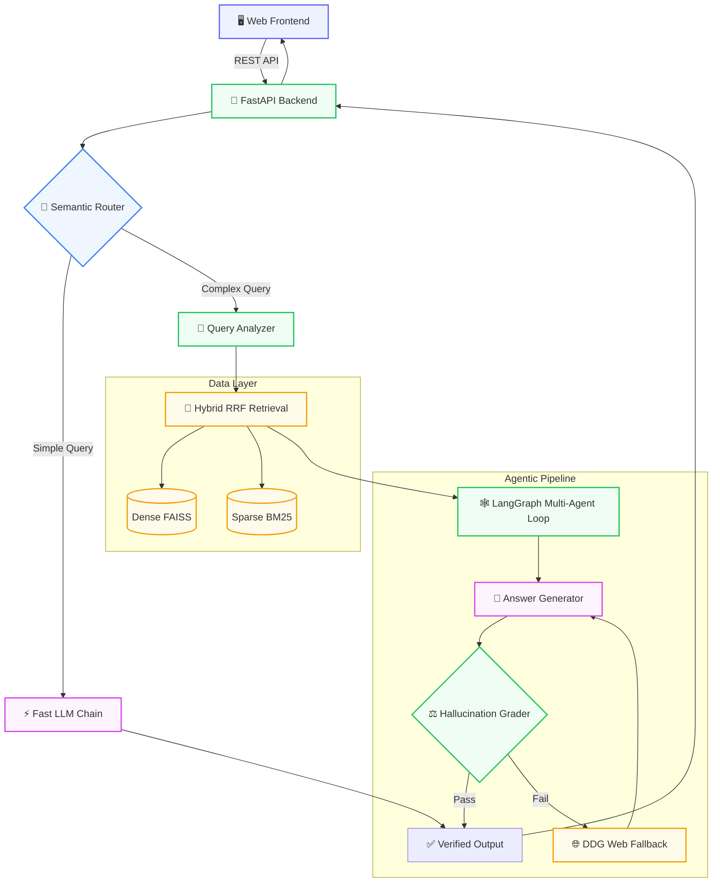
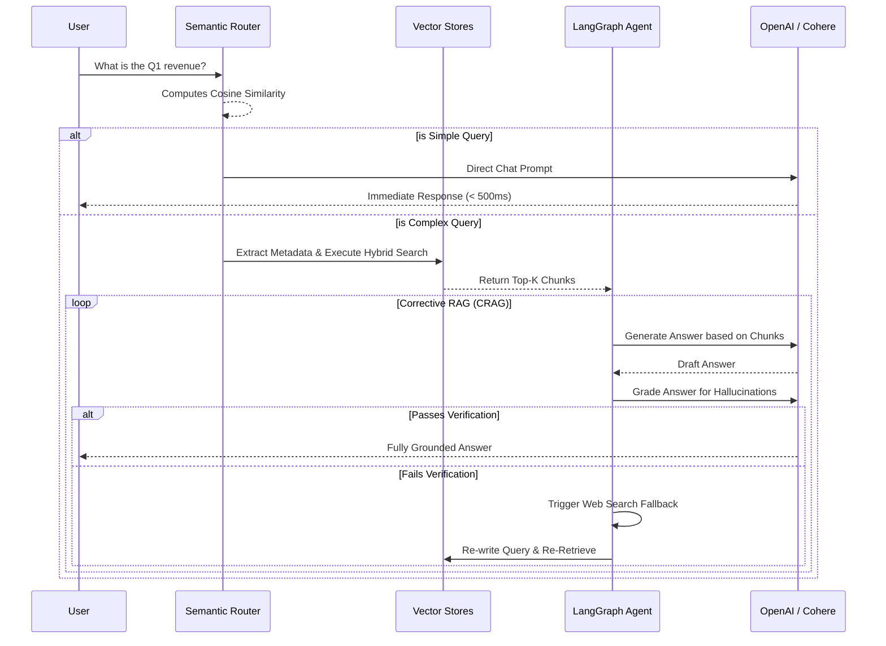

# 🌌 Aether AI: Conversational RAG Assistant

<div align="center">


*A production-grade, locally-persisted Corrective & Self-Reflective Conversational RAG pipeline developed to answer complex queries strictly from company documents.*

</div>

---

## 🪐 Project Overview

Standard Retrieval-Augmented Generation (RAG) systems frequently struggle in production due to three core challenges: **retrieval noise** (injecting irrelevant text), **hallucinations** (unsupported model outputs), and **high latency** (processing simple tasks through heavy pipelines).

This project solves these exact issues by employing a highly efficient **Dual-Path processing topology**:

1. **The Fast Path (Low-Latency Bypass)**: Simple inputs, greetings, or direct conversation bypass heavy vector stores entirely using an in-memory embedding-based **Semantic Router**, routing queries to a lightweight conversational agent in milliseconds.
2. **The Heavy Path (Self-Reflective Agents)**: Complex queries are routed to specialized pipelines where Pydantic Query Analyzers parse constraints. Retrieval combines dense (FAISS) and sparse (BM25) search indices via Reciprocal Rank Fusion (RRF), followed by a multi-agent **LangGraph** self-correcting loop. Final answers are strictly validated against hallucinations.

---

## 🏗️ System Architecture

Aether AI utilizes a decoupled multi-layer structure, segregating user interfaces, backend APIs, data pipelines, local databases, and external LLM services.


```mermaid
graph TD
    classDef client fill:#eef2ff,stroke:#6366f1,stroke-width:2px;
    classDef api fill:#f0fdf4,stroke:#22c55e,stroke-width:2px;
    classDef data fill:#fffbeb,stroke:#f59e0b,stroke-width:2px;
    classDef llm fill:#fdf4ff,stroke:#d946ef,stroke-width:2px;
    classDef router fill:#eff6ff,stroke:#3b82f6,stroke-width:2px;

    Client[🖥️ Web Frontend]:::client -->|REST API| FastAPI[🚀 FastAPI Backend]:::api
    
    FastAPI --> Router{🔀 Semantic Router}:::router
    
    Router -->|Simple Query| FastChain[⚡ Fast LLM Chain]:::llm
    Router -->|Complex Query| Analyzer[🔬 Query Analyzer]:::api
    
    Analyzer --> RRF[🔀 Hybrid RRF Retrieval]:::data
    
    subgraph Data Layer
        RRF --> FAISS[(Dense FAISS)]:::data
        RRF --> BM25[(Sparse BM25)]:::data
    end
    
    RRF --> LangGraph[🕸️ LangGraph Multi-Agent Loop]:::api
    
    subgraph Agentic Pipeline
        LangGraph --> Generator[🤖 Answer Generator]:::llm
        Generator --> Grader{⚖️ Hallucination Grader}:::api
        Grader -->|Pass| Final[✅ Verified Output]
        Grader -->|Fail| WebSearch[🌐 DDG Web Fallback]:::data
        WebSearch --> Generator
    end
    
    FastChain --> Final
    Final --> FastAPI
    FastAPI --> Client
```

---

## 🔄 Application Flow (Request Lifecycle)


```mermaid
sequenceDiagram
    participant User
    participant Router as Semantic Router
    participant DB as Vector Stores
    participant Agent as LangGraph Agent
    participant LLM as OpenAI / Cohere
    
    User->>Router: What is the Q1 revenue?
    Router-->>Router: Computes Cosine Similarity
    
    alt is Simple Query
        Router->>LLM: Direct Chat Prompt
        LLM-->>User: Immediate Response (< 500ms)
    else is Complex Query
        Router->>DB: Extract Metadata & Execute Hybrid Search
        DB-->>Agent: Return Top-K Chunks
        
        loop Corrective RAG (CRAG)
            Agent->>LLM: Generate Answer based on Chunks
            LLM-->>Agent: Draft Answer
            Agent->>LLM: Grade Answer for Hallucinations
            
            alt Passes Verification
                LLM-->>User: Fully Grounded Answer
            else Fails Verification
                Agent->>Agent: Trigger Web Search Fallback
                Agent->>DB: Re-write Query & Re-Retrieve
            end
        end
    end
```

---

## ⚡ Key Features

* 🔮 **Dual-Routing Switchboard**: Supports embedding-based local **Semantic Routing** (zero-token latency, in-memory) to classify query intent instantly.
* 🔬 **Pydantic Query Analyzer**: Automatically extracts database metadata filters (e.g., `publish_year`, `file_type`, `page_number`) to build strict queries.
* 🔀 **Hybrid Retrieval (RRF)**: Combines dense vector retrieval (FAISS) and sparse keyword retrieval (BM25) using Reciprocal Rank Fusion to ensure both semantic capture and exact keyword matches.
* 🕸️ **LangGraph Multi-Hop Decomposition**: Breaks complex, multi-faceted questions into sequential sub-questions, answering them one-by-one using intermediate context memory.
* 🌐 **Corrective RAG (CRAG)**: Grades retrieved documents and dynamically triggers DuckDuckGo web search to gather missing facts when local context is insufficient.
* 🪞 **Double-Guardrail Self-RAG Evaluator**: Uses a two-step validation chain (Hallucination Grader + Answer Relevance Grader) to run verification loops.
* ✂️ **Semantic Chunking**: Identifies meaning-based boundaries by tracking semantic drift across adjacent sentences, preventing paragraph truncation.
* 🎯 **Flashrank CPU Reranking**: Re-ranks candidates locally on CPU using optimized quantized cross-encoder models.

---

## 📂 Project Structure & Evolution

This repository contains both the final production-ready system and the original prototypes from the first phase of the development lifecycle:

```text
├── src/                  # (ACTIVE) Final Aether AI Engine (LangGraph, FAISS, FastAPI)
├── tests/                # (ACTIVE) Pytest suite for the final pipeline
├── data/                 # (ACTIVE) Master directory for raw PDFs and CSV files
├── documents/            # (ACTIVE) Runtime ingestion directory for FAISS vector generation
├── eval/                 # (ACTIVE) Golden JSON sets for faithfulness evaluation scoring
├── evaluate.py           # (ACTIVE) Custom evaluation harness to generate accuracy metrics
├── prototype_v1/         # (ARCHIVE) Original TF-IDF/ChromaDB basic scripts
│   ├── src/              # Obsolete basic retriever logic
│   ├── tests/            # Obsolete tests for basic logic
│   └── scripts/          # Obsolete manual data cleaning scripts
├── .github/              # CI/CD Workflows (tests active src/ and tests/)
└── Dockerfile            # Containerization for the active backend
```

> **Note**: The `prototype_v1/` directory contains legacy scripts from early development stages, preserved for historical context.

---

## 🛠️ Developer Setup & Experience

### 1. Environment Setup

Clone the repository and install dependencies using `uv` (a much faster pip alternative):

```bash
git clone https://github.com/yourusername/aether-ai.git
cd aether-ai

# Install dependencies
uv venv
source .venv/bin/activate
uv pip install -r requirements.txt
```

Create a `.env` file from the example:
```bash
cp .env.example .env
# Edit .env and add your OPENAI_API_KEY
```

### 2. Running Data Ingestion
Populate the FAISS and BM25 vector databases by processing the documents in the `documents/` folder:

```bash
python -m src.ingest
```

### 3. Starting the Server
Run the FastAPI backend server:

```bash
uvicorn src.app:app --host 0.0.0.0 --port 8000 --reload
```

### 4. Running Evaluations & Tests
To view the accuracy metrics and system faithfulness (verifying the jump from the flawed v1 to the fixed v2 golden set):

```bash
python evaluate.py
```
To run the automated CI pipeline tests:
```bash
pytest tests/
```

---

## 🐳 Docker Deployment

For clean isolation, the project includes a production-ready multi-stage `Dockerfile`.

```bash
# Build the image
docker build -t aether-ai .

# Run the container (injecting your API key)
docker run -p 8000:8000 \
    -e OPENAI_API_KEY="sk-proj-..." \
    aether-ai
```
*(Note: Docker ignores the archived `prototype_v1` and raw `data` folders to keep the container lightweight and strictly focused on production).*

---

## 🔒 Security & Quality Assurances
* **Least Privilege (Docker)**: The `Dockerfile` operates under a non-root user (`appuser`).
* **Path Traversal Protection**: Uploaded filenames are strictly sanitized before being saved to the file system.
* **No Leaked Secrets**: All API keys are loaded strictly via `.env` variables and `os.getenv()`.

---

> **Built with passion to push the boundaries of Local Corrective RAG systems.**
