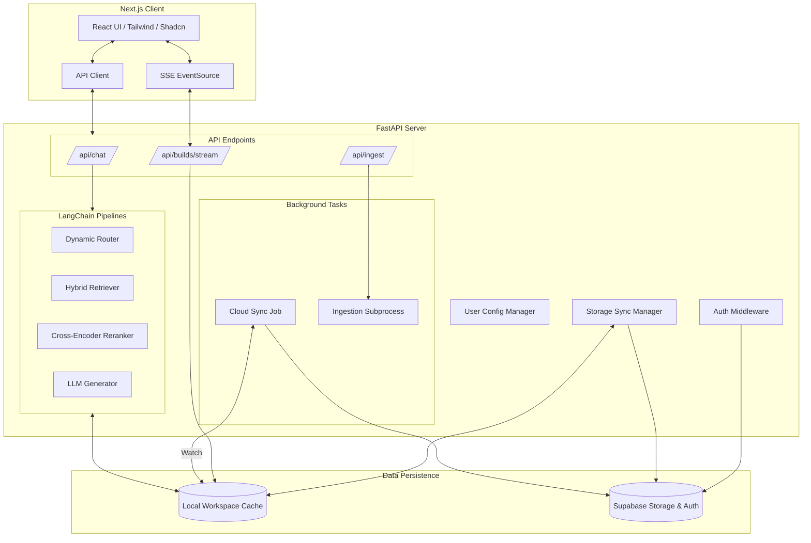
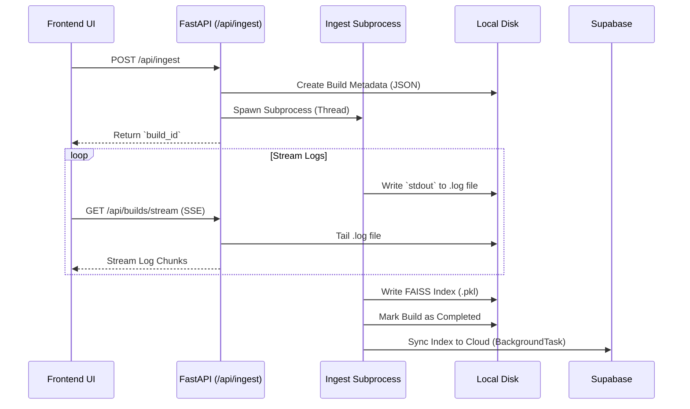

# Project Architecture Overview

This document outlines the architecture of our local-first, cloud-synced Retrieval-Augmented Generation (RAG) system. The application is designed to be highly modular, allowing it to function completely offline as a single-tenant local application, or scale seamlessly into a multi-tenant cloud application via Supabase.

## High-Level System Architecture

---

## Core Components

### 1. Frontend (Next.js)
- **Framework:** Next.js (exported as a static site) running in the browser.
- **Styling:** TailwindCSS and Shadcn/ui components for a polished, responsive user interface.
- **Features:** 
  - Chat interface with streaming responses.
  - Document management (uploading, staging, deleting).
  - Background build history with real-time SSE (Server-Sent Events) log streaming.
  - Configuration view for setting up local (Ollama) and cloud (OpenAI, Gemini, Anthropic) API keys securely.

### 2. Backend (FastAPI)
- **Framework:** Python FastAPI. Fast, asynchronous, and well-suited for heavily I/O bound tasks like streaming LLM tokens and streaming logs.
- **Concurrency:** Uses `asyncio` for request handling. Blocking operations (like hitting LangChain providers or syncing to the cloud) are offloaded to `BackgroundTasks` or thread pools (`asyncio.to_thread`).

### 3. The RAG Pipeline (LangChain)
The core of the application is a highly advanced Retrieval-Augmented Generation pipeline:
- **Vector Database:** FAISS for local, in-memory semantic search.
- **Hybrid Search:** Combines dense embeddings (FAISS) with sparse keyword search (BM25) for superior retrieval recall.
- **Reranking:** Uses `Flashrank` (a lightweight Cross-Encoder) to re-score and re-order the retrieved chunks before they are sent to the LLM.
- **RAPTOR Summaries:** Hierarchical cluster tree summaries that allow the LLM to answer high-level questions about entire document sets, rather than just isolated chunks.
- **Semantic Routing:** Intelligently routes incoming queries between "standard RAG" or "RAPTOR summarization" depending on the question's intent.

### 4. Storage & Tenant Isolation
The system follows a "Local-as-Cache, Cloud-as-Durable" philosophy.
- **Local Workspaces:** All files are stored in `workspaces/{user_id}/`. For single-user local mode, the ID is `local`.
- **Supabase Cloud Sync:** When authentication is enabled, the backend intercepts requests, verifies the JWT, and dynamically sets the workspace. Files (documents, vector indexes, configs) are synced to a Supabase bucket in the background.
- **Row-Level Security (RLS):** Supabase Storage buckets are secured via PostgREST RLS policies. The backend acts *as the user*, passing their JWT directly to Supabase. There are no admin/service-role keys in the backend, meaning tenant isolation is cryptographically guaranteed by the database.

---

## Ingestion Workflow (Background Jobs)

Because embedding documents can take a long time on local models, the ingestion process is detached from the API layer.

1. **Trigger:** User clicks "Build index". The API generates a `build_id` and immediately returns it.
2. **Execute:** A Python subprocess runs the `backend.ingest` module. It writes its stdout/stderr directly to a local `.log` file.
3. **Stream:** The frontend connects via SSE. The FastAPI server reads the log file as it grows and streams it to the UI.
4. **Finalize:** Upon completion, the pipelines are reloaded into memory, and the resulting FAISS index is synced up to Supabase without blocking the user.
